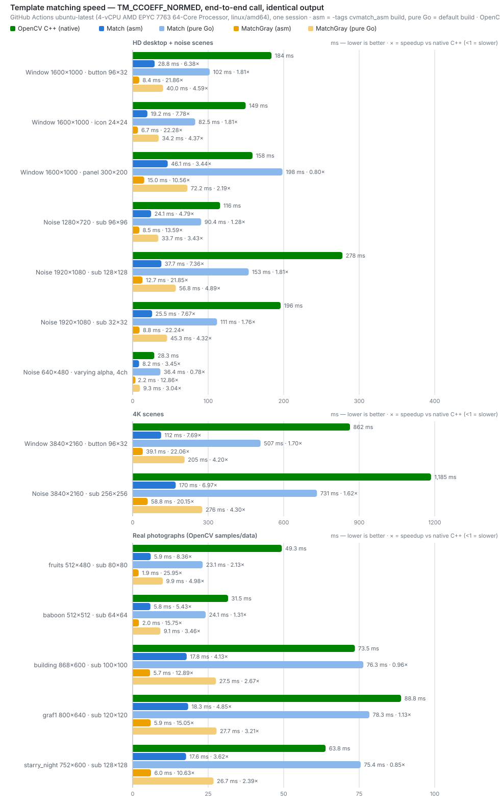
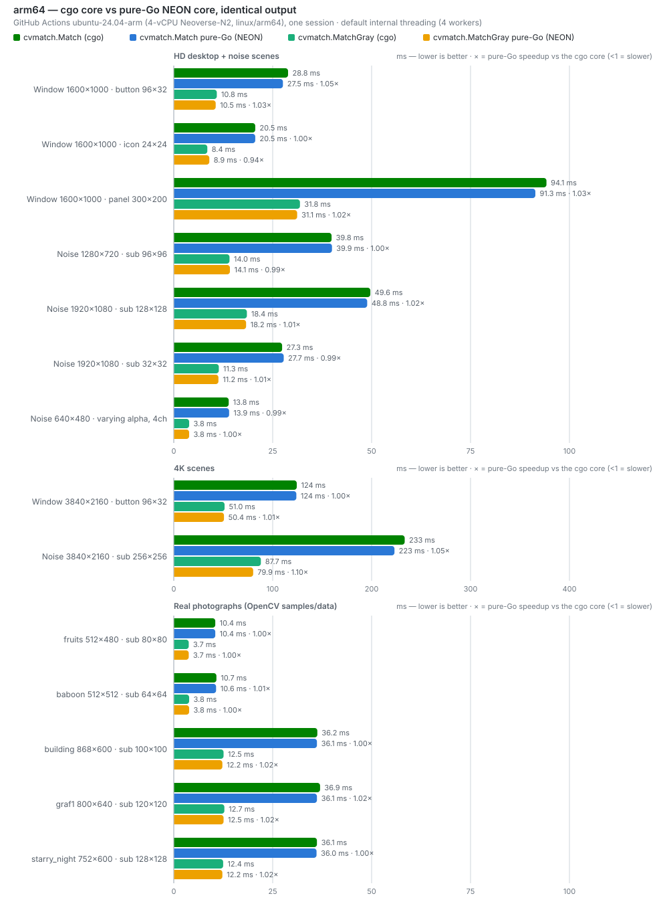
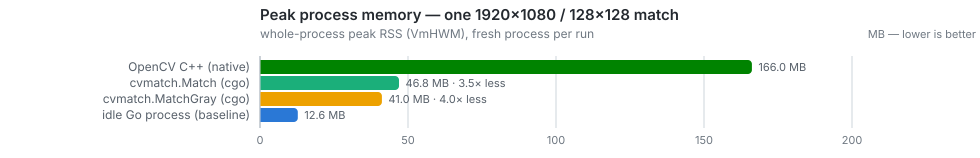

# cvmatch

[](../../actions/workflows/ci.yml) [](https://pkg.go.dev/github.com/hkloudou/cvmatch) 

OpenCV-compatible `TM_CCOEFF_NORMED` template matching in **pure Go** — no
OpenCV, no cgo, no bundled static libraries, no dependencies. Two build
modes, selected by one global tag:

- **Default build**: 100% high-level Go on every platform — the safe
  choice (nothing hand-written to audit, memory safety is the
  compiler's), and plain cross-compilation just works.
- **`-tags cvmatch_asm`**: swaps the hot loops for hand-written SIMD
  kernels — AVX2 on amd64 (runtime-detected), NEON on arm64 — worth
  roughly **3–4x end to end**. For when performance is the point; output
  is bit-identical to the default build, asserted by the test suite in
  both modes.

Output is pinned two ways. Element-wise against **native OpenCV C++** on
every CI run — see [Accuracy](#accuracy-cvmatch-vs-native-c) for the
measured comparison. And **bit-exactly** against golden output hashes: the
library once shipped a cgo/C core, and this pipeline reproduces its
output maps bit-for-bit (the golden constants were recorded from the C
core, cross-validated, before it was retired for being the slower core on
both amd64 and arm64 — see
[Benchmarks](#benchmarks-cvmatch-vs-native-c)). The same bits come out on
every architecture, at every thread count, in both build modes;
`cvmatch.Impl` reports `"purego"`, kept for compatibility.

```go
import "github.com/hkloudou/cvmatch"

// matchTemplate(TM_CCOEFF_NORMED) + minMaxLoc in one call:
minVal, minX, minY, maxVal, maxX, maxY := cvmatch.Match(parent, sub)

// Grayscale fast path (~2.5x faster again; ideal for screenshots/UI
// hunting). Alpha is dropped here by design — the same semantics as
// OpenCV's COLOR_RGBA2GRAY; use Match when alpha carries signal:
minVal, minX, minY, maxVal, maxX, maxY = cvmatch.MatchGray(parent, sub)

// Full response map (find every occurrence above a threshold):
resp, w, h := cvmatch.MatchMap(parent, sub)
```

`Match` panics if an image is empty or `sub` is larger than `parent`
(mirroring OpenCV's assertion on the same condition).

## What it does

`Match` is `matchTemplate(TM_CCOEFF_NORMED)` + `minMaxLoc` in one call:
**find the best match of a small image inside a big one**. Every score is a
Pearson correlation coefficient in `[-1, +1]`: `+1` = perfect match (up to a
brightness/contrast shift), `0` = unrelated, `-1` = perfect *inverse* match
(the window looks like the template with colors inverted). So the answer is
the maximum — `maxVal` close to `1.0` means a confident hit whose top-left
corner is `(maxX, maxY)`. `minVal`/`minLoc` are **not** "the worst spot"
(that would be ≈0); they are the strongest inverse match — useful for
hunting color-flipped patterns (dark-mode icons), ignorable otherwise, and
kept for six-tuple compatibility with OpenCV pipelines, where the SQDIFF
methods treat the *minimum* as best.

`MatchMap` returns the whole score map (`resp[y*w+x]` = score of placing the
template's top-left corner at `(x, y)`), which unlocks what a single best
hit cannot: finding **every** occurrence (threshold + local-maximum
suppression with a radius about half the template size — verified by
`TestFindAllOccurrences`, which recovers five planted copies exactly),
**ambiguity checks** (if the second-highest peak nearly ties the highest —
three look-alike buttons — the match is not trustworthy even at
`maxVal≈1`), ROI-restricted search, sub-pixel refinement by fitting the
peak's neighborhood, and heatmap debugging.

Below, the green box is drawn at the location `Match` returned for each
template (images live on the [`assets`](../../tree/assets) branch; rendered
by `bench/cmd/annotate`):

| template | found in parent | result |
|---|---|---|
|  |  | `maxVal=0.999996` @ (893,614) — the right button among three look-alikes |
|  |  | `maxVal=1.000000` @ (305,210) |
|  |  | `maxVal=1.000000` @ (250,180) |
|  |  | `maxVal=1.000000` @ (420,240) |
|  |  | `maxVal=0.999999` @ (350,260) |
|  |  | `maxVal=0.999999` @ (400,300) |
|  |  | `maxVal=1.000000` @ (217,143) — **varying-alpha** scene; the PNG stores the tested bytes verbatim (straight alpha, per-pixel 64–255), so it renders genuinely semi-transparent |

## Alpha and semi-transparency: what OpenCV actually does

Questions about the alpha channel come up often enough to answer precisely.
All claims below were checked against OpenCV's C++ source
(`modules/imgproc/src/templmatch.cpp`), not its documentation.

- **`matchTemplate` has no transparency semantics.** On CV_8UC4 input the
  alpha plane is a plain fourth data channel: the source contains no alpha
  handling anywhere — every channel loop is unconditional, so alpha bytes
  enter the sums and the correlation exactly like color bytes. Nothing is
  composited, blended or weighted. cvmatch replicates that: a
  semi-transparent pixel is just four numbers.
- **By default OpenCV never even sees alpha.** `cv::imread` strips the
  alpha channel unless explicitly asked to keep it (`IMREAD_UNCHANGED`),
  so a typical OpenCV pipeline matches 3-channel data.
- **"Transparency-aware" matching is a different OpenCV feature.**
  `matchTemplate` accepts an optional mask argument, which weights template
  pixels (a mask can be derived from the template's alpha plane). That is a
  separate, substantially slower code path; the classic
  4-channel-image-to-Mat pipeline passes no mask, and cvmatch implements
  only the unmasked path (a documented scope difference — see below).
- **The constant-alpha skip changes nothing.** Screenshots almost always
  carry alpha = 255 everywhere. For a channel that is constant within each
  image, its contribution to the CCOEFF_NORMED numerator, denominator and
  template norm cancels *algebraically*, so `Match` skips it — ~25% less
  work, provably identical output. The skip triggers only when **both**
  images have a constant alpha plane; tests cover the skip
  (`TestConstantAlphaSkip`, four constants including 0/255), the non-skip
  (`TestVaryingAlpha`, `TestAlphaMixedConstancy`), and the fact that alpha
  genuinely matters when it varies (`TestAlphaMatters`: cn=3 vs cn=4 maps
  differ materially). The varying-alpha scene is additionally pinned
  element-wise against native C++ output in CI.
- **A Go-specific gotcha, documented for fairness:** Go's `*image.RGBA` is
  alpha-**premultiplied** by convention, while PNG (and `image.NRGBA`, and
  OpenCV's `IMREAD_UNCHANGED`) store **straight** alpha. cvmatch consumes
  `*image.RGBA` bytes as-is and redraws other formats through
  `image/draw` (which premultiplies) — identical to the classic
  ImageToMatRGBA pipeline it replaces. Feeding the same bytes to cvmatch
  and OpenCV gives the same map (that is exactly what the parity harness
  does); but decoding a semi-transparent PNG in Go and in
  `imread(IMREAD_UNCHANGED)` produces *different byte values* for the
  non-opaque pixels before any matching starts. This also bit the demo
  image above: `png.Encode` un-premultiplies `*image.RGBA` pixels on
  encode, which wraps values in test data whose R/G/B exceed A — the demo
  is therefore encoded from the identical bytes reinterpreted as NRGBA, so
  the published file byte-for-byte equals the tested input.

## Accuracy: cvmatch vs native C++

The claim "same result as OpenCV" is measured, not asserted, over the full
scene set — not only on perfect crops. Two scenes are deliberately degraded
so the peak lands mid-range, and one searches a patch that is not in the
image at all, so the noise floor of the map is compared too.

**`Match` (best value)** — from `TestNativeValues`, run in CI against the
same response maps dumped by the C++ binary; the four rows below span the
score range (the full 17-scene log is printed in every CI run):

| scene | peak | native C++ | cvmatch |
|---|---|---|---|
| window button (perfect crop) | ~1.0 | 0.999997 @(893,614) | 0.999996 @(893,614) |
| degraded_button (noisy template) | high | 0.903974 @(893,614) | 0.903974 @(893,614) |
| half_degraded_noise | mid | 0.565384 @(431,285) | 0.565385 @(431,285) |
| absent_patch (not in the image) | noise | 0.180137 | 0.180136 |

For the absent patch the whole map is noise-level, so the argmax legally
lands on different near-tied bumps; the value is what matters. Positions
agree exactly on every scene with a real peak.

**`MatchMap` (every element) vs native C++** — from
`TestFullMapParityWithNativeCpp`: the C++ binary dumps its full CV_32F
response map per scene and every element of `cvmatch.MatchMap` is compared
against it:

| scene group | worst element diff vs native C++ |
|---|---|
| dense noise (720p / 1080p×2 / 4K / alpha / half-degraded) | ≤ 2.4e-06 |
| photographs (5 scenes) | ≤ 8.2e-05 |
| synthetic UI windows (4 scenes) | ≤ 4.7e-04 |
| degraded_button / absent_patch | ≤ 4.4e-04 |

The larger UI-scene numbers are where the true score is ~0 in near-flat
regions and float32 rounding dominates; the *peak* values agree to 1e-6
everywhere (table above). The library is also compared against a **float64
brute-force reference** implementing OpenCV's formulas from the definition
(≤1e-4; includes 1x1 templates, template == image, zero-variance
templates, varying alpha).

**Bit-identity guarantees** (exact equality, not tolerances):

- `TestGoldenOutputs` pins the exact output bits — FNV-64 hashes of whole
  response maps plus extrema — over nine dispatch shapes (1/3/4-channel,
  strided, packed-RGB, degenerate). The constants were recorded from the
  retired cgo/C core and cross-validated against this pipeline before its
  removal, and the C core was itself pinned element-wise against native
  OpenCV; the anchors must reproduce on **every architecture** (the same
  single-rounded IEEE op sequence runs everywhere, including a
  deterministic `sincospi` for twiddles — no libm trig, so output does not
  vary across glibc/musl/OS math libraries).
- `TestSIMDMatchesScalar` asserts the assembly kernels (AVX2 and NEON)
  equal the generic Go loops bit-for-bit (each vector lane performs
  exactly the scalar op sequence).
- `TestThreadsBitIdentical` / `TestThreadsVar` assert byte-equal maps and
  extrema for 1/2/3/4/8/16 workers, and `TestConstantAlphaSkip` asserts
  the constant-alpha skip is a no-op.

Everything in this section runs in CI on every push, on both amd64 and
arm64 runners, in both build modes (default and `-tags cvmatch_asm`).

## Benchmarks: cvmatch vs native C++

> The charts, the measured matrix and `docs/benchdata.json` are
> **auto-generated**: the `bench-charts` workflow re-measures native
> OpenCV and cvmatch (amd64 and arm64) in one session on every push to
> `main` and commits the refreshed SVGs and table (`docs/collect.py`
> parses the raw outputs, `docs/genchart.py` renders). The machine is
> named in the chart subtitle and above the table. Series colors mean the
> same thing on every chart: green = native OpenCV C++,
> blue = `cvmatch.Match`, orange = `cvmatch.MatchGray`.

Scenarios cover a realistic workload — finding a button, a toolbar icon or
a panel inside a rendered desktop window (flat regions, gradients, text,
look-alike widgets) — plus dense-noise worst cases and **real
photographs** from
[OpenCV's `samples/data`](https://github.com/opencv/opencv/tree/4.12.0/samples/data)
(Apache-2.0; `bench/testdata/fetch.sh` downloads them, and they are
mirrored on the [`assets`](../../tree/assets) branch for viewing):

| image | size | template | content |
|---|---|---|---|
| [`fruits.jpg`](../../raw/assets/samples/fruits.jpg) | 512×480 | 80×80 @ (305,210) | fruit bowl, saturated colors |
| [`baboon.jpg`](../../raw/assets/samples/baboon.jpg) | 512×512 | 64×64 @ (250,180) | fur, high-frequency texture |
| [`building.jpg`](../../raw/assets/samples/building.jpg) | 868×600 | 100×100 @ (420,240) | architecture, repeating windows |
| [`graf1.png`](../../raw/assets/samples/graf1.png) | 800×640 | 120×120 @ (350,260) | graffiti wall (VGG dataset) |
| [`starry_night.jpg`](../../raw/assets/samples/starry_night.jpg) | 752×600 | 128×128 @ (400,300) | painting, swirling gradients |

The baseline is **native OpenCV C++**: `bench/cpp/native_bench`, plain C++
linked against prebuilt static OpenCV 4.12 archives (Release, WITH_IPP=OFF,
SIMD dispatch on), timed end-to-end per call, best-of-7. No wrapper of any
kind sits between the timer and OpenCV.

### Fairness rules

- **End-to-end timing everywhere.** Every implementation is timed over the
  complete per-call path starting from an in-memory RGBA frame — image/Mat
  conversion, matching, min/max scan, cleanup. No implementation gets to
  keep pre-converted inputs or reuse buffers across calls.
- **Byte-identical inputs.** `bench/cmd/dumpscenes` exports the exact pixel
  buffers the Go benchmarks use; the C++ benchmark consumes those dumps.
- **Representative OpenCV build.** The static 4.12 archives are a standard
  Release build. Two alternatives were measured to rule out a weak
  baseline: a distro build (Ubuntu 24.04, OpenCV 4.6.0) lands within ±7%
  on every scene, and a `WITH_IPP=ON` build of the same 4.12 source
  (official defaults, IPPICV 2022.1.0, full AVX2/AVX512 dispatch) measured
  **1.2–3.7x slower** than the IPP-off build on these scenes — the IPP DFT
  path inside `crossCorr` underperforms OpenCV's own DFT here, and
  `ipp_matchTemplate` itself bails out on multi-channel input and never
  covers TM_CCOEFF_NORMED anyway. The baseline used is the fastest OpenCV
  configuration measured.
- **Threading disclosed, both sides get the cores.** OpenCV's
  `matchTemplate` path does not use extra cores (measured: its times are
  flat across thread settings), so the honest multi-core OpenCV baseline
  is caller-side parallelism. That was measured in an earlier round:
  splitting the parent into 4 overlapping strips and matching them
  concurrently with OpenCV made the big multi-tile scenes 3–3.5x faster —
  still slower than cvmatch's internal parallelism there, and on
  single-tile scenes (panel, the photos) strip-parallel OpenCV can close
  most of its 1T gap. Single-thread columns are in the matrix below for
  like-for-like reading.
- **Verified-equal outputs.** The parity suite above compares every
  response-map element against the C++ binary — no speed comes from
  computing something different.
- **One machine, one session.** All numbers in the charts and the matrix
  come from one session on the machine named in the chart subtitle (the
  `bench-charts` workflow refreshes them on every push to `main`); expect
  some run-to-run variance on shared cloud CPUs. CI additionally
  re-measures on every push (`-cpu 1,4`, amd64 and arm64, both builds),
  publishing raw numbers in the job summary.

Reproduce locally with `go test -bench . -benchtime 5x -cpu 1,4` (add
`-tags cvmatch_asm` for the SIMD build), plus
`bench/cpp/build.sh && bench/cpp/native_bench bench/cpp/scenes 7`.

<picture>
  <source media="(prefers-color-scheme: dark)" srcset="docs/bench-dark.svg">
  
</picture>

<picture>
  <source media="(prefers-color-scheme: dark)" srcset="docs/bench-arm64-dark.svg">
  
</picture>

<picture>
  <source media="(prefers-color-scheme: dark)" srcset="docs/mem-dark.svg">
  
</picture>

### The full matrix (measured)

<!-- benchmatrix:begin — auto-generated by docs/genchart.py, do not edit by hand -->
`Match`, milliseconds, measured on GitHub Actions ubuntu-latest (4-vCPU AMD EPYC 7763 64-Core Processor, linux/amd64).
Native C++ is the best of 7 end-to-end runs, single-threaded because
that is how OpenCV's `matchTemplate` runs; the cvmatch columns are
`go test -benchtime 5x` averages from `-cpu 1,4` — the asm columns
are the `-tags cvmatch_asm` build, the pure-Go columns the default
build:

| scene | native C++ | asm 1T | asm 4T | pure-Go 1T | pure-Go 4T |
|---|---|---|---|---|---|

**arm64** — the same `Match` matrix from the arm64 CI leg (GitHub Actions ubuntu-24.04-arm (4-vCPU Neoverse-N2, linux/arm64)),
NEON kernels vs the default build, bit-identical output to the
amd64 rows above:

| scene | asm 1T | asm 4T | pure-Go 1T | pure-Go 4T |
|---|---|---|---|---|
<!-- benchmatrix:end -->

**Readings, including where cvmatch does *not* win:**

- The **SIMD build** (`-tags cvmatch_asm`) is **faster than native OpenCV
  on every scene single-threaded** — from ~2.2x on the 4-channel
  varying-alpha scene (no constant-alpha skip there — 4 full channels) up
  to ~8x on the smallest photo. Internal threading adds another 2–3.5x on
  multi-tile scenes (the big windows/noise scenes land at ~7–12x total on
  4 cores).
- The **default build** pays roughly 3–4x versus the SIMD build (scalar
  complex arithmetic with pinned roundings resists compiler
  vectorization), so against native OpenCV it wins on some scenes and
  loses on others single-threaded — read its own columns in the matrix
  rather than the headline. Internal threading pulls it back ahead of
  native on the big multi-tile scenes.
- Threading helps least on **single-tile scenes** (panel, the photos):
  only the normalization pass parallelizes there, because re-tiling the
  FFT would change the rounding path. Since the normalize scan got its
  vector kernel it is a small win rather than a wash, but the FFT part of
  those scenes stays single-threaded by design. Caller-side strip
  parallelism over OpenCV can close most of its gap on such scenes (see
  fairness rules) — that residual is real and documented in the headroom
  section.
- The kernels have two full backends — AVX2 on amd64 and NEON on arm64,
  bit-identical to each other and to the scalar loops (asserted by the
  golden hashes reproducing on both CI architectures in both build
  modes). This pipeline retired the original cgo/C core by
  out-benchmarking it on both architectures; the golden tests carry the
  C core's cross-validated output forward as the permanent anchor.
- Steady-state matching allocates ~0 in both modes: scratch is recycled
  through pools (a few MB/op appear on the largest scenes when GC clears
  the pools between calls).

### Native code size and memory (linux/amd64)

| artifact | size |
|---|---|
| static OpenCV archives the C++ baseline links (`libopencv_core.a` + `libopencv_imgproc.a` + zlib) | 16.1 MB |
| minimal `Match` binary, `-ldflags "-s -w"`, pure Go | **1.53 MB** (a comparable OpenCV-linked Go binary measured 5.82 MB before that comparison was retired) |

Peak whole-process memory for one 1920×1080 / 128×128 match (VmHWM, fresh
process per run, values from `docs/benchdata.json`; the native probe is
`native_bench … mem` — one end-to-end match, the process reads its own
VmHWM): idle Go process ~14 MB, `cvmatch.Match` ~48 MB,
`cvmatch.MatchGray` ~42 MB, native OpenCV C++ ~155 MB. OpenCV
materializes full double-precision integral
images (~132 MB written per 1080p RGBA call); cvmatch replaces them with
O(width) sliding sums, so its peak is dominated by the input frame and the
float32 response map themselves.

## Algorithm

The pipeline is exactly OpenCV's `matchTemplate(TM_CCOEFF_NORMED)`
(`modules/imgproc/src/templmatch.cpp`). Verified by diffing the C++ sources
directly: **4.8.1 → 4.12.0** changes only error-constant naming, an
expression refactor in the *masked* path (not this pipeline — an empty mask
takes the unmasked path replicated here) and an IPP enum cosmetic;
**4.12.0 → 5.x** only removes the legacy C-API `cvMatchTemplate` shim. The
unmasked TM_CCOEFF_NORMED pipeline is byte-identical across 4.8.1, 4.12.0
and 5.x:

1. `crossCorr()` — cross-correlation computed with block-based DFT
   (overlap-save tiling, `blockScale = 4.5`, `minBlockSize = 256`, template
   spectrum transformed once per channel, per-channel accumulation);
2. `common_matchTemplate()` — per-window normalization
   `num = corr - Σ wndSum_k·templMean_k`,
   `den = sqrt(max(wndSum2 - wndMean2, 0)) · templNorm`, including OpenCV's
   exact guards: the `min(0.5, 10·FLT_EPSILON·wndSum2)` rounding cutoff and
   the `1.125` saturation band;
3. `minMaxLoc()` — row-major scan, first occurrence wins on ties.

Window sums and sums-of-squares are integers accumulated in `double`, so they
are **bit-identical** to OpenCV's integral-image values; the only float32
rounding source is the correlation itself, which OpenCV also computes in
float32 — that is why parity holds to ~1e-6 on well-conditioned scenes.

### Differences from OpenCV, exhaustively

Three categories, from harmless to functional:

**A. Implementation differences with provably zero output change**

| difference | why the output is identical |
|---|---|
| sliding column sums instead of `sum`/`sqsum` integral images | both are exact integer arithmetic in `double` (< 2^53) — bit-identical window statistics |
| `minMaxLoc` fused into the normalization pass | same row-major scan, same strict-comparison first-occurrence tie rule, comparing the same rounded float32 values OpenCV would scan |
| constant-channel (alpha) skip | algebraic cancellation: a per-image-constant channel contributes exactly 0 to numerator, denominator and `templNorm` (`TestConstantAlphaSkip` asserts cn=3 ≡ cn=4) |
| zero-copy input, template spectrum pre-scaled by `1/(dftW·dftH)` | pure plumbing; same numbers enter the math |

**B. Float32 rounding-path differences (bounded, measured)**

| difference | consequence |
|---|---|
| power-of-two FFT (radix-2, two-real-rows-per-complex-FFT) instead of OpenCV's mixed-radix 2^a·3^b·5^c DFT | different DFT sizes and summation orders ⇒ different float32 rounding, *not* different math. Measured element-wise vs the C++ binary — see the Accuracy table |
| DFT scratch capped at 2^21 complex elements (OpenCV has no cap) | for pathologically large templates the tiling gets finer — again a rounding-path change only |

**C. Scope differences (things cvmatch deliberately does not do)**

- Only `TM_CCOEFF_NORMED`. The other five methods (SQDIFF/CCORR families)
  are not implemented.
- No mask support — the classic 4-channel pipeline passes an empty mask,
  which takes the unmasked OpenCV path this library replicates.
  Transparency-weighted matching therefore isn't available here (see the
  alpha section above).
- Input is 8-bit, 1–4 channels; OpenCV also accepts CV_32F input.
- Input conversion happens in Go's image model: `*image.RGBA` is consumed
  as-is (premultiplied bytes), other formats are redrawn through
  `image/draw`. OpenCV pipelines that `imread` a file get straight-alpha
  or alpha-stripped bytes instead — same matcher, different bytes in
  (see the alpha section).
- Errors surface as Go panics instead of C++ exceptions.

Nothing in category A or B changes which location wins or by how much beyond
float32 noise — that is what the parity layers in Accuracy pin down on every
run.

## Concurrency and the Threads switch

Every public function is **safe for concurrent use** — calls share no
result state; scratch buffers are recycled through synchronized pools and
every pooled buffer is fully overwritten before use (`TestConcurrentMatch`
runs the suite under `-race`). That splits parallelism into two distinct
problems:

- **Throughput (many matches): just use goroutines — no library support
  needed.** Matching 100 screenshots, or one screenshot against 20 button
  templates, scales to ~N× on N cores by running `Match` calls concurrently.
- **Latency (one big match): one call spreads its FFT tiles and
  normalization bands across workers with bit-identical output for any
  worker count** (asserted byte-for-byte by `TestThreadsBitIdentical`).
  Single-tile scenes parallelize only the normalization pass by design —
  re-tiling would change the FFT rounding path.
- **DIY middle ground:** because every TM_CCOEFF_NORMED output depends only
  on its own window, a caller *can* split one large parent into horizontal
  strips overlapping by `subHeight−1` rows, `Match` them concurrently and
  merge the extrema. Results land in the same float32-rounding class as the
  whole-image call (the FFT tiling shifts, so values differ at ~1e-6 like
  any replan); ties at the strip merge need the row-major-first rule to
  mirror `minMaxLoc` exactly.

The worker count is controllable:

```go
cvmatch.Threads = 1 // pin single-threaded; 0 = automatic (GOMAXPROCS, ≤16)
```

or `CVMATCH_THREADS=1` in the environment (read once at package init).
Any value produces bit-identical results — it is a performance knob only,
mainly useful for benchmarking and for capping the library's CPU use inside
a loaded service. Set it before concurrent use; it is a plain package
variable.

## Recipe: describing a window (one frame, many ROIs, many templates)

The building blocks already compose — no dedicated API needed. Convert the
frame to gray **once**, take zero-copy `SubImage` views per ROI, and each ROI
may check any number of expected templates (pre-convert templates to gray
once at startup; they are reused every frame):

```go
// once per frame (~7 ms at 1080p when the screenshot is RGBA;
// free if your source is already *image.Gray or JPEG/YCbCr)
gray := image.NewGray(frame.Bounds())
draw.Draw(gray, gray.Bounds(), frame, frame.Bounds().Min, draw.Src)

type expect struct {
	name string
	tpl  image.Image // pre-converted gray, reused across frames
}
groups := map[image.Rectangle][]expect{
	okArea:   {{"ok", okTpl}, {"ok_disabled", okDisabledTpl}},
	trayArea: {{"wifi", wifiTpl}, {"muted", mutedTpl}},
}

for roi, expects := range groups {
	view := gray.SubImage(roi) // zero-copy view; search cost ~ ROI area
	for _, e := range expects {
		_, _, _, score, x, y := cvmatch.MatchGray(view, e.tpl)
		if score >= 0.95 {
			fmt.Printf("%s at (%d,%d) score=%.3f\n",
				e.name, roi.Min.X+x, roi.Min.Y+y, score) // frame coords
		}
	}
}
```

Notes: returned coordinates are ROI-relative — add `roi.Min`. Every function
is safe for concurrent use, so wrapping the outer loop in goroutines is fine
(one goroutine per ROI is a good shape). Small-ROI searches cost well under
a millisecond each; the per-frame gray conversion is usually the largest
single line item, which is why it is hoisted out of the loop.

## Why the same math runs faster here

OpenCV's `matchTemplate` is not slow because of sloppy code — the cost is in
**what its generic pipeline does per call**. For one 1920×1080 RGBA `Match`
(template 128×128):

| per-call work | OpenCV | cvmatch |
|---|---|---|
| input handover | copy into a `Mat` (8.3 MB) | zero-copy: the core reads Go's `*image.RGBA` buffer in place |
| channels correlated | 4 (alpha included) | 3 when alpha is constant (provably zero contribution) |
| DFT row transforms | complex path per channel | 2 real rows packed per complex FFT (half the row FFTs), zero pad rows skipped |
| DFT column transforms | strided per-column walks | batched butterflies over contiguous rows (vectorizes, cache-friendly) |
| window statistics | materialize `sum` + `sqsum` double integral images: **~132 MB written to DRAM, then read back** | O(width) sliding integer column sums: **~60 KB working set, stays in L1/L2** |
| min/max | separate `minMaxLoc` pass over the 8 MB result | scanned per row inside the normalization pass, while the data is cache-hot |
| hot loops | generic SIMD dispatch | explicit AVX2/NEON kernels (FFT butterflies, conj-multiply, normalize sqrt/divide) behind the `cvmatch_asm` build tag |
| result values | — | element-wise equal (verified vs the C++ binary) |

The decisive line is the integral images: on a modern CPU a 1080p RGBA
`matchTemplate` is largely **memory-bandwidth-bound**, and ~140 MB of DRAM
traffic per call is pure overhead when the same integer window sums can be
produced incrementally in cache. The identities that make the shortcuts safe
are exact, not approximate:

- a sliding column sum over integers (int32/int64 here, doubles in
  OpenCV) yields *bit-identical* window statistics to subtracting
  integral-image corners — every value is an exact integer below 2^53
  either way;
- for a channel that is constant within each image, `templSdv = 0` and
  `corr − wndSum·templMean` cancels algebraically, so dropping the alpha
  plane changes no output bit;
- the correlation itself stays float32 block-DFT — the same numeric path
  OpenCV uses — which is why the response maps agree to ~1e-6.

Three alternative explanations were measured and ruled out:

1. **Not binding overhead.** The baseline is plain C++ calling OpenCV
   directly. (A Go binding driving the same archives was also measured
   during development and stayed within ~0–4% of the C++ times.)
2. **Not the build flags.** A distro OpenCV (Ubuntu 24.04, 4.6.0) lands
   within ±7% of the static 4.12 build used.
3. **Not missing IPP.** `WITH_IPP=ON` measured 1.2–3.7x *slower* here (see
   fairness rules); IPP cannot accelerate this call anyway.

## Is OpenCV's algorithm the optimum? Remaining headroom

Deep-dive, with every claim either measured on this codebase or adversarially
reviewed. First, where a 1080p/128 `Match` spends its time (stage-isolated
harness, measured before the SIMD-kernel rounds; both stages got faster
since, with correlation keeping the dominant share):

| stage | gray (1ch) | RGBA (3ch after alpha skip) | share |
|---|---|---|---|
| plan construction | ~0 ms | ~0 ms | ~0% |
| block-FFT correlation | 40.5 ms | 122.7 ms | **80–87%** |
| normalization + minMaxLoc | 10.8 ms | 17.4 ms | 13–20% |

**Verdict on the algorithm itself: right race, not the fastest car.** The
block-FFT + window-statistics skeleton is the correct asymptotic choice —
overlap-save tiling makes it O(N·log M) in template size M, and no exact
dense-correlation algorithm asymptotically better than FFT-based is known
(Winograd trades multiplies for more additions; a proof of optimality does
not exist either — unrestricted lower bounds remain open). But "right
asymptotic class" is where OpenCV's optimality ends: its implementation of
that skeleton loses measurably to this one at identical outputs (integral
images, 4 forced channels, unfused scans), and the list below is headroom
*this* implementation still leaves on the table under the same
results-identical-to-OpenCV contract.

Ranked levers — several landed in the SIMD-kernel rounds, the rest remain:

1. **Multithreading — implemented (measured 2.5–3.8x on 4 cores for
   multi-tile scenes).** Correlation tiles stride across workers (each
   with private scratch, channels accumulated in order per tile) and
   normalization splits into row bands, each rebuilding its own column sums
   — bit-exact *only because* the window statistics are exact integers
   (< 2^53, every add exact, hence order-independent); the same trick on
   float inputs would not be. Extrema merge band-in-order to keep OpenCV's
   first-occurrence tie rule. The known residual: single-tile scenes (small
   photos, the panel) only parallelize normalization — the finer bit-exact
   axes (independent row-FFT pairs, width-chunked column butterflies) are
   still on the table, and until they land, strip-parallel OpenCV can close
   most of its gap on such scenes (see fairness rules).
2. **A better FFT kernel — the SIMD half landed.** The hot loops run
   explicit assembly kernels (interleaved-complex butterflies,
   broadcast-twiddle column passes) with a swap-pair bit reversal; the
   column FFT consumes *fused stage pairs* (a closed quad of rows makes
   one memory round trip for two butterfly layers — legal bit-exactly
   because butterflies chain the same values registers or not), and the
   row FFT folds the half=1/2 stages into the same asm pass. The remaining
   half is algorithmic: split-radix cuts operation counts ~31% at these
   sizes (radix-4 only ~15%) — but unlike the SIMD work it *changes the
   rounding path*, so it moves outputs within the float32 envelope instead
   of preserving them bit-for-bit, and it stays unimplemented while the
   anchored-output contract is worth more than the constant.
3. **Mixed-radix (2·3·5) DFT sizes** would cut power-of-two padding waste (up
   to 2x per dimension worst case; exactly zero in lucky cases — 897+127
   lands on 1024 precisely). Same caveat as split-radix: different rounding
   path, so it trades away bit-stability of the output.
4. **Output-pruned inverse column FFT** (ancestor pruning of the existing
   butterfly network — the variant that keeps retained outputs bit-identical;
   Sorensen-Burrus decomposition would not). Only the first `blockH` of
   `dftH` output rows are consumed. O(n·log M) is real, but against this
   planner's actual regimes it is worth ~1.2–1.4x of one FFT pass in capped
   configurations and ≤~15% end-to-end — a niche win. (Bit-exactness caveat
   discovered during the kernel round: skipped butterflies on exact-zero
   padding can flip signed zeros, so a landing needs the same ±0 analysis
   the normalize kernel got.)
5. **Normalization: break the recurrence — implemented.** An ablation
   measurement had shown the pass was latency-bound on the loop-carried
   double-add chains (~20 cycles/pixel), not on sqrt or DRAM. Exactly the
   predicted fix landed: the integer window sums are spilled per chunk
   (order-free because exact) and the sqrt/divide/guard tail runs as a
   branchless vector kernel over cache-resident lanes, as do the per-row
   column-sum slide and the fused min/max scan (with OpenCV's
   first-occurrence ties, via a lexicographic (value, index) lane
   tournament). The residual is the window-sum spill's sequential prefix;
   SIMD prefix-sum lanes remain possible.
6. **Plumbing — mostly implemented:** per-size twiddle/swap-pair tables are
   cached for the process lifetime and all scratch is pooled. Remaining:
   skipping the normalized write-back when the caller wants only `Match`
   extrema — a few ms on big scenes.

**What the contract forbids — including being *better*.** With 8-bit inputs,
a number-theoretic transform over the prime 29·2^57+1 computes the raw
correlation *exactly* in integers (one prime covers any realistic template;
the two-rows-per-transform packing even survives, since −1 has a square root
mod p) at the same O(N log N) — strictly more accurate than OpenCV's float32
DFT wherever float32 rounds. Requiring results identical to OpenCV rules it
out: the constraint forbids not only approximations (pyramids,
early-termination bounds, feature matching) but also exactness OpenCV itself
doesn't have. That is the cleanest evidence that OpenCV's pipeline is an
engineering compromise, not an optimum: correct asymptotics, beatable
constants, and sub-optimal accuracy by design.

Where exactly would NTT output differ from OpenCV? Only in the raw
correlation's rounding. For a 128×128 RGB template, `corr` reaches ~1e9
while float32 resolves only ~64 apart at that magnitude, so OpenCV's (and
cvmatch's) correlation is off by up to ±32 before normalization — that is
precisely the ~1e-6 noise the parity tests measure, and NTT removes it.
This mode was **built, measured, and then removed** (`MatchExact`, present
only in the v1.1.x tags): the Montgomery-NTT correlation worked and was
bit-identical across platforms, but measured ~17x slower
than `Match` (64-bit modular butterflies have no SIMD; the two-real-rows
packing does not survive in Z_p, doubling transform count and column
width — a data point that also refutes the intuition "integer arithmetic
is faster than floating point" for this workload). Since this library's
product goal is speed at OpenCV-identical output, exceeding OpenCV's
accuracy at a 17x cost earned no keep; the analysis stays recorded here.

## Optimization details

Same math, different engineering:

- **No integral images.** OpenCV materializes full double-precision `sum` and
  `sqsum` integrals before normalizing — for a 1080p RGBA parent that is
  ~132 MB of writes before any matching happens. cvmatch produces the same
  window statistics from **O(width) sliding integer column sums** (int32 per
  column per channel plus an int64 square-sum lane, updated by one
  add/subtract per row step; every value is an exact integer, so the double
  window math downstream sees bit-identical inputs). That single change is
  most of the peak-memory gap and removes an entire memory-bound pass.
- **Normalize + minMaxLoc in one pass.** The normalization pass evaluates
  each row with a branchless vector kernel and scans min/max (identical
  first-occurrence tie semantics to OpenCV's scan) while the row is still
  cache-hot, so `Match` never needs a second full-map pass or buffer.
- **2-for-1 real FFT.** The DFT is a compact power-of-two radix-2 kernel. Row
  transforms pack **two real rows into one complex FFT** (re/im) and untangle
  the two spectra afterwards — halving row-FFT work exactly where OpenCV uses
  its real-DFT machinery. Fully-zero padding row pairs are skipped, bit
  reversal runs off a precomputed swap-pair list, and per-size
  twiddle/swap-pair tables are cached for the process lifetime.
- **Explicit SIMD kernels, identical values, opt-in.** With
  `-tags cvmatch_asm`, the FFT stage cascade, the column-direction
  butterflies (contiguous row segments — a straight-line sweep instead of
  a strided walk), the conjugate multiply, the normalize sqrt/divide
  tail, the sliding column sums, the min/max scan and RGBA→gray run
  hand-written `internal/simd` assembly — AVX2 behind a runtime CPU check
  on amd64, NEON on arm64; worth ~3–4x end to end. Every vector lane
  performs exactly the scalar op sequence (individually rounded
  multiplies and adds, never FMA), so the kernels change nothing but
  time. The default build compiles none of it — `simd.Enabled` is a
  constant false and every kernel call site dead-code-eliminates, leaving
  pure high-level Go.
- **libm-free trig.** Twiddle factors come from a deterministic internal
  `sincospi` (exact dyadic reduction + fdlibm-style kernels) — the reason
  results do not vary across glibc/musl/OS math libraries.
- **Template spectrum pre-scaled.** The `1/(dftW·dftH)` inverse-DFT factor is
  folded into the template spectrum once per channel, so the per-block inverse
  transform needs no extra normalization sweep.
- **Provably skippable constant channels.** For a channel that is constant
  within each image, `templSdv = 0`, the window variance contribution is 0 and
  `corr - wndSum·templMean` cancels exactly — so it contributes *nothing* to
  CCOEFF_NORMED. `Match` detects a constant alpha plane (virtually every
  screenshot) with a cheap scan and processes 3 of 4 channels: ~25% less work,
  bit-equivalent output, asserted by `TestConstantAlphaSkip`.
- **Zero-copy inputs.** `*image.RGBA`, `*image.Gray` and the Y plane of
  `*image.YCbCr` (JPEG) are handed to the core with their native strides —
  sub-images included, no redraw, no copies. The uint8→float conversion
  happens inside the block-load loop, which is a copy the FFT needs anyway;
  the parent image is never converted or duplicated as a whole.
- **Bounded scratch.** DFT tile buffers are capped (~16 MB each even for
  pathological template sizes; a few hundred KB in typical scenarios), and
  the only full-size allocation is the float32 response map itself. All
  scratch is recycled through `sync.Pool` (every pooled buffer is fully
  overwritten before use), so steady-state matching allocates ~0.
- **`MatchGray`** trades exact RGBA parity for a single-channel pipeline
  (OpenCV's fixed-point BT.601 RGB2GRAY weights; YCbCr images use their Y
  plane directly with zero conversion): ~4x less FFT and normalization work,
  which is the right default when hunting UI elements in screenshots.

## Layout

- `impl.go` — the matching core: block-FFT correlation, sliding-window
  normalization, fused minMaxLoc, tile/band parallelism.
- `internal/simd/` — the assembly kernels, compiled only under
  `-tags cvmatch_asm` (AVX2 on amd64, runtime-detected; NEON on arm64):
  FFT stage cascades and fused column-stage quads, byte→complex packing,
  spectrum untangle/combine, result emit, sliding column sums, the
  normalize tail, first-occurrence min/max scan and RGBA→gray, plus the
  generic fallback declarations.
  Every kernel executes the scalar loop's exact op sequence — asserted
  bit-for-bit by `TestSIMDMatchesScalar` and the kernel unit tests, and
  across architectures by the golden output hashes. The NEON bodies live
  in `internal/simd/_gen/kernels.S` (annotated ARM64 assembly) and are
  spliced into `simd_arm64.s` as WORD streams by `_gen/gen.py` (Go's
  assembler has no un-fused vector FP arithmetic); CI regenerates and
  diffs the stream to keep them in lockstep.
- `cvmatch.go` — public API and zero-copy image conversion.
- `scenes/` — deterministic benchmark/parity scenes shared by the main
  module's benchmarks and the native comparison in `bench/`.
- `bench/` — separate module holding the native-C++ comparison
  (element-wise parity + value tests, `memprobe` peak-RSS tool,
  binary-size probe) so the root module stays dependency-free.
- `bench/cpp/` — the native OpenCV C++ benchmark (`build.sh` fetches
  prebuilt static OpenCV 4.12 archives and matching headers;
  `cmd/dumpscenes` exports byte-identical scene images).
- `bench/testdata/fetch.sh` — downloads the real sample photographs.
- `bench/cmd/annotate` — renders the match-result demo images shown above
  (published on the `assets` branch).
- `docs/collect.py` / `docs/genchart.py` / `docs/benchdata.json` — the
  benchmark-chart pipeline: `collect.py` parses raw benchmark outputs into
  `benchdata.json`, `genchart.py` renders the SVGs and rewrites the README
  matrix. The `bench-charts` workflow runs both on every push to `main`
  and commits the refresh.

## Requirements and releases

None beyond Go — no C toolchain on any platform, ever: `go build` and any
cross-compilation just work.

The assembly is a global opt-in switch:

```sh
go build ./...                    # default: 100% high-level Go, the safe mode
go build -tags cvmatch_asm ./...  # SIMD kernels (amd64 AVX2 / arm64 NEON), ~3-4x faster
```

The default build contains no hand-written assembly at all — memory
safety is entirely the Go compiler's, which is the right trade for most
services. `-tags cvmatch_asm` swaps in the kernels for performance-
critical deployments; output is bit-identical in both modes (the golden
anchors and the asm-vs-scalar parity suite run in both modes, on both
architectures, in CI). On architectures without kernels the tag is a
no-op and the scalar code runs either way.

Versions are tagged from `main` via the *Tag release* workflow
(`.github/workflows/tag.yml`); CI runs the full test + parity + benchmark
suite on every tag.
